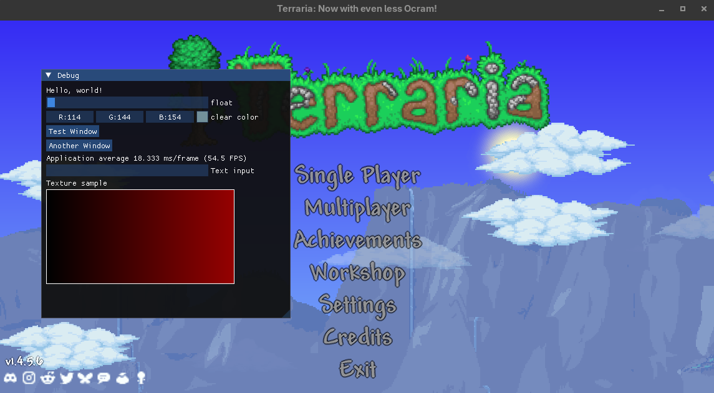

# ClrHook.Terraria

ClrHook.Terraria is a proof-of-concept (POC) client for Terraria (FNA/MonoGame) on Linux, based on the [clrhook](https://github.com/SignatureBeef/clrhook) loader. It demonstrates runtime detour/injection using [MonoMod.RuntimeDetour](https://github.com/MonoMod/MonoMod) and ImGui.NET overlays, requiring no hard patching of the game binaries.

## Principles
- All core functionality is implemented using runtime hooks (no static patching)
- Built on top of MonoMod and MonoMod.RuntimeDetour
- Designed for extensibility and easy integration with other mods or overlays

## Features
- Runtime method detouring and event hooks for Terraria internals
- ImGui.NET integration for in-game overlays and tools
- Example hooks for `Main.Draw` and `Main.LoadContent`
- Linux-native support (tested with FNA and MonoGame)
- Easy to extend for your own overlays or experiments

## Getting Started
1. Edit `env.props` and/or `env.override.props` as needed for your environment or build overrides.
2. Build the project using your preferred .NET build system (targeting net48).
3. Copy the resulting DLLs and dependencies to the appropriate Terraria or clrhook loader directory.
4. Launch Terraria with the clrhook loader.

## Example
Below is a screenshot of the ImGui overlay in action which is running in Terraria's embedded mono .NET4 runtime, via a .NET4.8 DLL.

## Requirements
- Terraria (FNA/MonoGame, Linux)
- .NET Framework 4.8 compatible runtime
- MonoMod.RuntimeDetour
- ImGui.NET
- [clrhook](https://github.com/SignatureBeef/clrhook) loader

## Credits
- [MonoMod](https://github.com/MonoMod/MonoMod)
- [ImGui.NET](https://github.com/ImGuiNET/ImGui.NET)
- [clrhook](https://github.com/SignatureBeef/clrhook)
- Terraria by Re-Logic

## License
This project is for educational and research purposes. Respect Terraria's EULA and modding guidelines.
